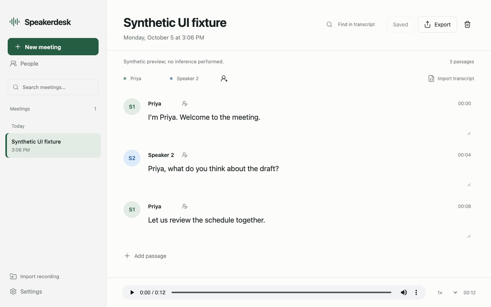
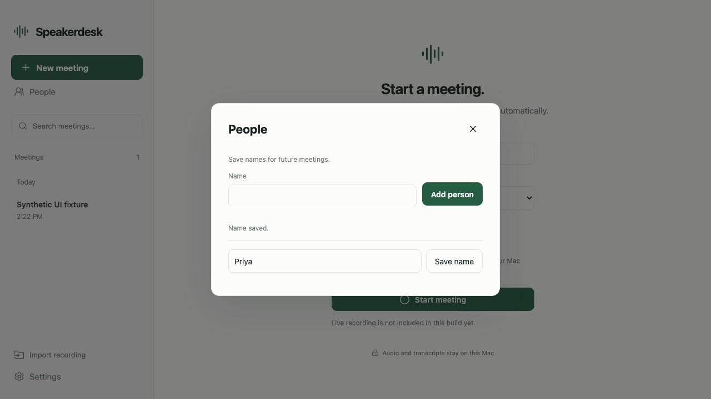
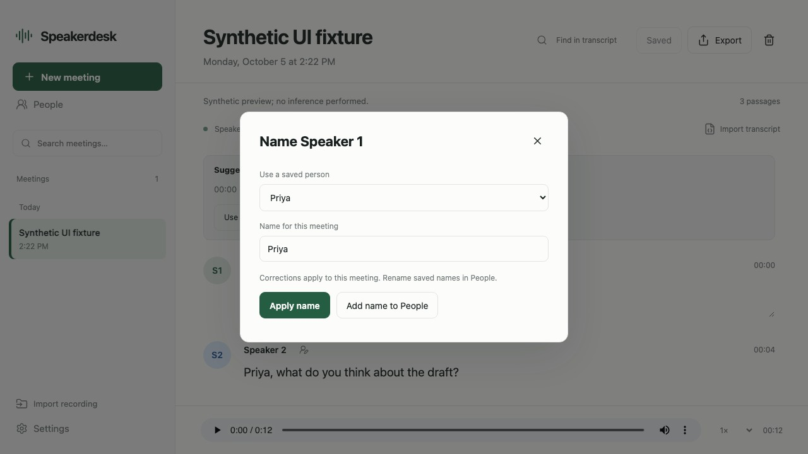

# Speakerdesk

Private meeting transcription and speaker labeling for Apple Silicon Macs, using NVIDIA Nemotron 3 diarization and Cohere Transcribe through MLX. Audio stays on the Mac; the app downloads pinned public model checkpoints during explicit setup. No paid transcription API is required.

The desktop shell uses Tauri, a bundled Python runtime and a Swift microphone/system-audio capture helper. macOS 15 or newer and an Apple Silicon processor are required. Allow roughly 4.1 GB for model setup including prepared timing weights and additional space for recordings. The core models occupy about 1.8 GB; the current timing provider adds about 1.7 GB including prepared GPU weights. This source repository contains no recordings, model weights, credentials or prebuilt application.

## Interface previews

These previews use invented names and transcript text with silent fixture audio. Native capture and model inference were not run for these screenshots. Meeting and name-picker images follow your GitHub light or dark appearance.

### Meeting

Review speaker names, edit passages and export the transcript.

<picture>
  <source media="(prefers-color-scheme: dark)" srcset="docs/screenshots/meeting-dark.jpg">
  
</picture>

### People

Save names for future meetings.



### Name picker

Choose a saved person or apply a name to this meeting.

<picture>
  <source media="(prefers-color-scheme: dark)" srcset="docs/screenshots/name-picker-dark.jpg">
  
</picture>

## Development

Install Node.js 24, Rust 1.97.1, `uv`, and Apple command line tools. Then run:

```sh
./scripts/setup.sh
./scripts/run_local.sh
```

The local web app opens at http://127.0.0.1:8790. Use its setup control to download models. Importing audio works in this mode; native capture requires the desktop helper built by the Apple packaging script. CPU lifecycle tests do not download models or record audio:

```sh
.venv-package/bin/python -m unittest discover -s tests -v
```

## Apple builds

`Apple package` is a manual GitHub Actions workflow. Its default ad-hoc mode produces private test artifacts. Ad-hoc signing does not establish trusted distribution or notarization. Exact candidate signing/notarization uses the separate approved AppleRelease workflow with existing central Apple credentials; see [credential reuse](docs/credential-reuse.md). No secrets are provisioned by the producer and no release is published.

```sh
APPLE_SIGNING_IDENTITY="existing Developer ID identity" ./scripts/build_macos.sh
```

Local real-model streaming has been exercised on synthetic two-voice speech. CPU CI checks timing, lifecycle and access controls; it does not prove noisy-meeting accuracy, native capture quality or packaged-model parity. Live text replaces stable canonical utterances; Stop performs bounded larger-context refinement while preserving human edits and original audio. NVIDIA supplies independent speaker activity and Cohere supplies all words. Required supplied-text timing covers all fourteen configured languages, with independent coarse accuracy calibration in English. CJK character units and unsupported or uncertain units remain explicit; their ownership is never inferred from missing timing. Setup verifies the timing provider before admitting transcription, and a runtime failure keeps existing text while exposing a retry. Exported passage times are retained audio anchors. See [canonical protocol](docs/silero-canonical-protocol.md) and [alignment scope](docs/alignment-integration-status.md).

The current build remains a release candidate until notarization, normal first-launch checks and native meeting capture checks succeed. [Download contract](docs/download-contract.md) describes the future stable download handoff.

People saves reusable local names; corrections and confirmed introduction suggestions apply to the current meeting. Reusable voice recognition uses the pinned MLX Metal GPU candidate with bounded natural functional evidence. Startup verifies policy and model metadata without prediction; explicit enrollment and background recognition share one owned inference child. Legacy saved names and profile bytes are retained, with incompatible identities requiring deliberate Remember voice replacement. CoreML policies that permit CPU execution remain unavailable. See [GPU voice startup and scope](docs/gpu-voice-startup.md) for qualification limits and the remaining real integration proof. When a compatible backend is qualified, each new speaker can be checked after multiple clean clips, and diarization carries the name through the meeting. Uncertain speakers keep their current label. Choose Remember voice explicitly to save a profile; automatic matches never create or update profiles. Historical native synthetic extraction and a scripted-session pilot used the previous backend policy; they do not qualify the current accelerator-only candidate. See [People and voice profiles](docs/people-and-voice-profiles.md) and the [integration and measurement results](docs/redimnet2-integration.md).

Third-party model and dependency terms are included in [packaging/THIRD_PARTY_NOTICES.md](packaging/THIRD_PARTY_NOTICES.md) and the accompanying license files. NVIDIA's checkpoint uses OpenMDW 1.1; Cohere's checkpoint uses Apache 2.0. Model licenses remain applicable when downloading weights separately.
