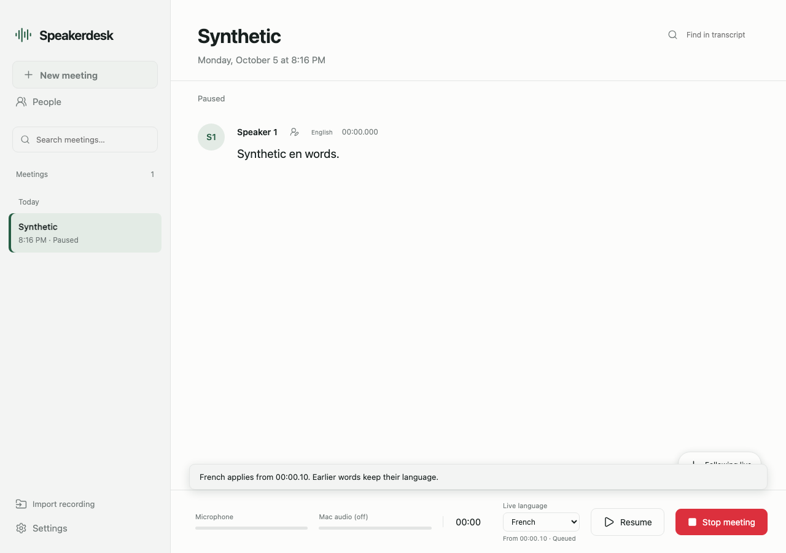
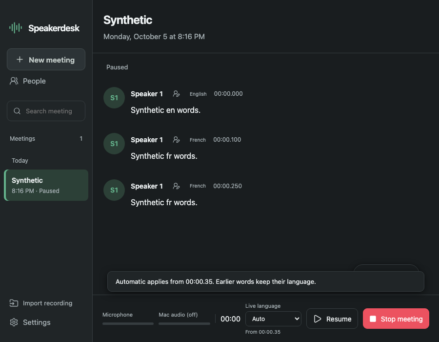

# Changing language during a meeting

The footer beside Pause/Resume now offers **Live language: Auto or a supported language**. It is available while recording or paused. Settings → Default language continues to govern new meetings and imports independently.

Changing the live selection creates a sample boundary in the current recording. The footer shows `From mm:ss.xx`, with `Queued` until the worker registers that revision. Earlier transcript text remains unchanged. Existing passage retry remains the explicit way to reconsider earlier words.

## Boundary contract

The server records a separate, monotonic `language_revision` and `language_history`. Each history entry has `generation`, `language` and `start_sample`, measured in the saved 16 kHz mono recording. Initial generation is zero. The authenticated endpoint is:

```text
PATCH /api/meetings/<id>/language
{"language":"fr","language_revision":0}
```

The audio sink and endpoint share a lock. Persistence, the saved-audio cursor, and the ordered PCM/control queue therefore agree on a single boundary. An accepted change is written before its control message is queued. A stale revision returns 409; unavailable local models return 409; a full queue returns 429 before accepting the change. Starting, finishing and inactive meetings reject updates. Selecting the current mode is a no-op.

| Audio/result | Language used |
| --- | --- |
| Already finalized text | Its original language and text |
| ASR currently in flight | The generation attached to that audio |
| Already saved PCM waiting in the worker queue | Its original generation, before the displayed boundary |
| Uncommitted phrase crossing the boundary | Split into the original and new generations |
| Capture/mixer tail not yet saved when the change is accepted | New generation, beginning at the displayed saved-audio boundary |
| Resumed audio after a paused change | New generation |

This boundary is the saved recording position, not the latest processed transcript position. Older queued audio is not silently relabelled. The mixer may still hold its existing short alignment tail at the moment of the change. The footer identifies the actual recording boundary.

Every emitted subpassage carries its own UUID, actual PCM start/end offsets, `language_generation` and `language_mode`, alongside its detected/manual `language`. The server rejects an unknown generation, a segment crossing its generation boundary or a mismatched manual language before appending it. Failure stops the meeting using the existing audio-preserving cleanup path.

Rapid changes at the same sample position create zero-length intermediate generations; the last selection governs subsequent audio. A worker acknowledgement means the ordered update has been registered, rather than that all transcription has completed. Late status responses cannot restore a superseded language revision in the browser.

On entry to each nonempty generation, routing resets language detection history for all speakers. The local detector is loaded lazily for Auto and reused across subsequent changes. Import routing uses the same transcriber with its original behavior. Phrase cuts at the language boundary remain marked for review. `voice_eligible` and `speaker_candidates` retain their separate single-speaker contract, so this ASR review flag does not prevent otherwise eligible voice clips.

## Validation and handoff

Based on main `846286eed2f358d3dfc6afced8ecf8b0cef2a96a` (0.3.0), in isolated branch `codex/live-language-control`.

All **120 CPU tests passed** in 25.274 seconds, including nine new language-control tests. These exercise real server routes, subprocess pipes, SQLite and WAV persistence with synthetic capture/worker peers, and the real live worker with model boundaries replaced by CPU mocks. They cover in-flight output, rapid changes, exact PCM splitting, changing while recording with both sources selected, pause/resume, restart, a separate new-meeting default, stale revisions, authentication, unavailable Auto, failed persistence, a full queue and incorrect worker language. Existing import, editor/export, source selection, backlog/error cleanup, voice recognition and passage retry regressions pass.

Three runtime fault controls confirm the assertions detect ignored routing changes, stale automatic-language history and admission of mismatched worker output. These deliberately fail at behavior assertions and do not edit production source.

The real HTML/JS and API also passed six headless Chromium fixture checks with zero page errors: stale poll protection, unchanged Settings default, unchanged earlier English text, French routing after resume, repeated paused changes, compact layout and retained text export. Evidence and four screenshots are in ignored `evidence/live-language/`.

Committed screenshots show synthetic fixture text, not actual capture or model output:





To reproduce with an existing environment and browser installation:

```sh
PYTHONDONTWRITEBYTECODE=1 <existing-python> -m unittest discover -s tests -v
PYTHONDONTWRITEBYTECODE=1 <existing-python> tests/support/live_language_browser.py
# Use the URL and temporary folder printed by the fixture:
node tests/live_language_browser.cjs <url> <folder> evidence/live-language <existing-playwright-package>
```

Stop the fixture process after testing; it releases its peers and temporary data. No model or browser downloads are required by these checks.

The rolling-refinement lane must preserve the original generation and PCM offsets for an existing passage; it must not apply the current meeting mode to an earlier candidate. The identity lane continues to use finalized subpassage audio offsets, unique IDs and independent voice eligibility. Files overlapping those lanes are `live_worker.py`, `live_meeting.py`, `language_detection.py` and the main HTML/JS/CSS; combine through the parent integration branch.

Native packaged UI, microphone/system capture, OS permission handling and bilingual model inference remain unverified by this fixture. No heavy build, inference or download was performed while CodeStory owned the resource window. Free disk remained 40,960,000,000 bytes. The selected tool environment did not expose native UI automation or cross-thread coordination messaging; the parent receives the completed branch/patch through the delegated-task result.
