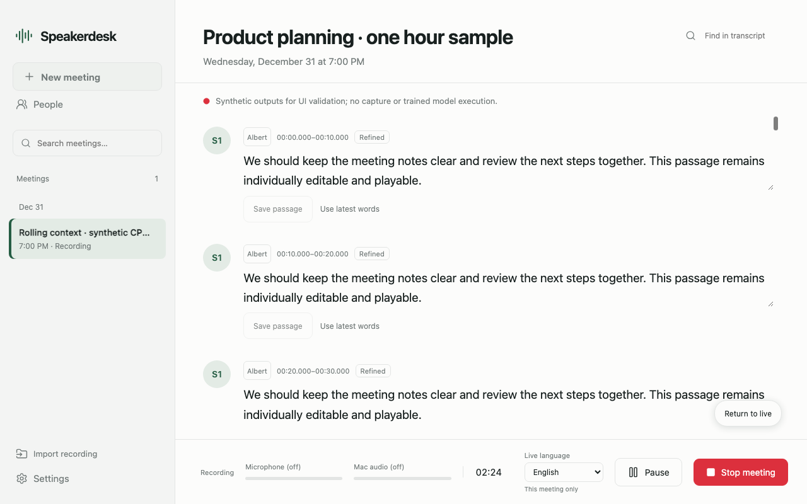
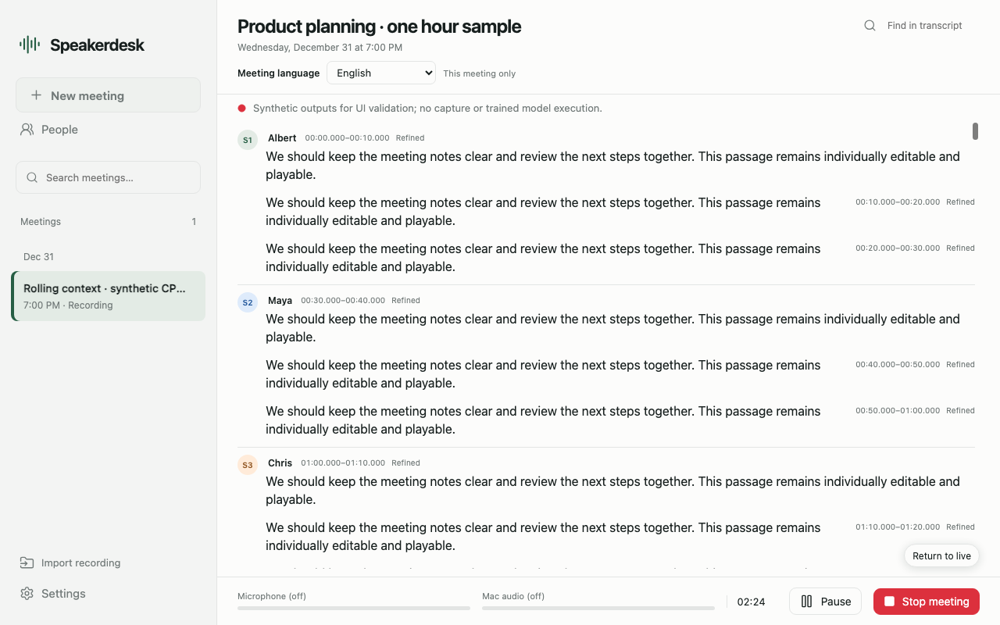
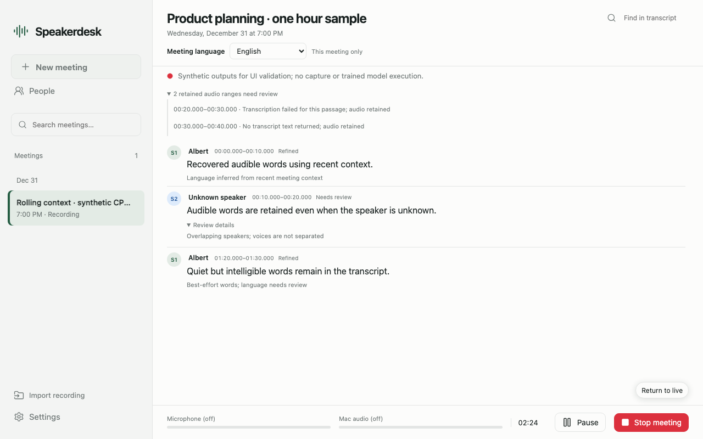
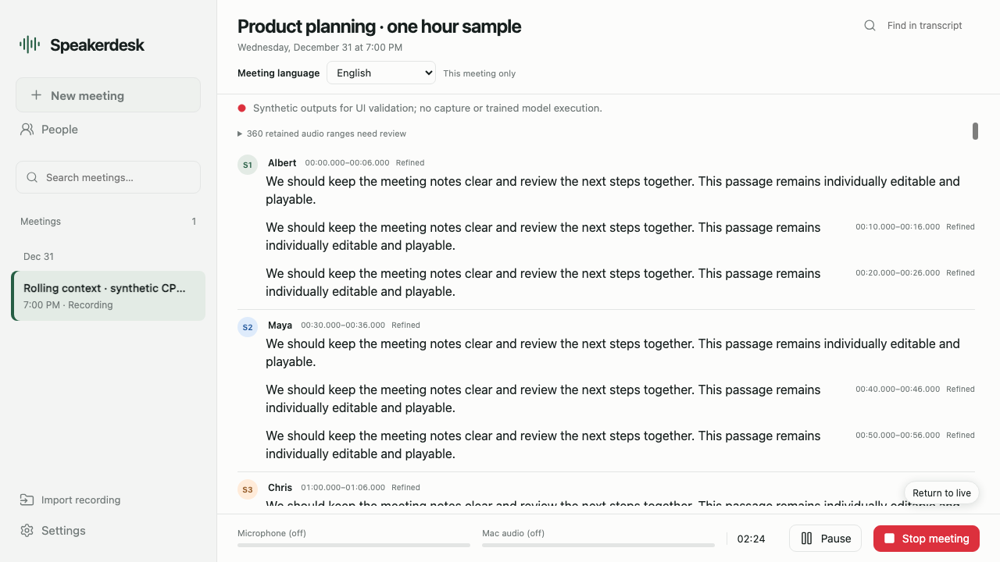
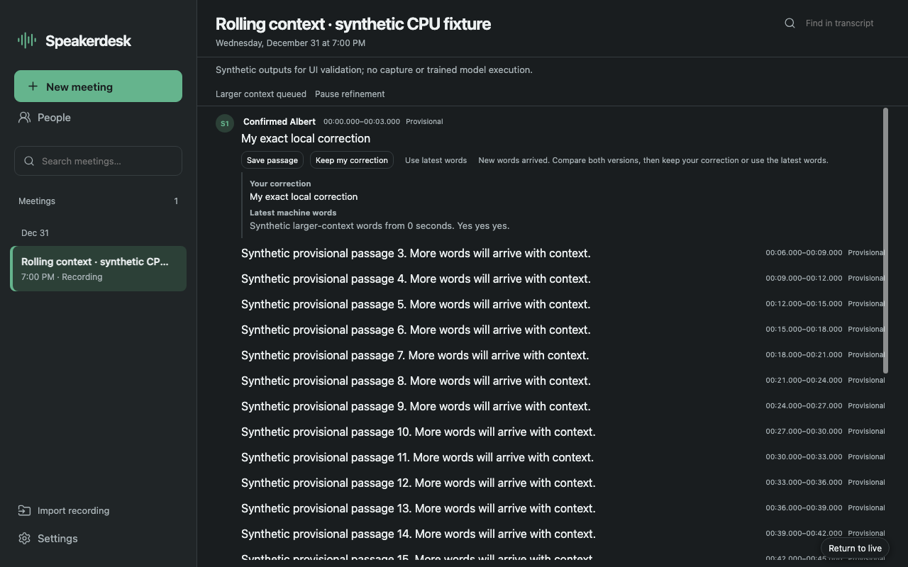

# Meeting language, transcript recovery and safe exports

The released 0.4.0 UI placed the current-language selector beside capture controls
and repeated visible language-retry selectors on saved passages. Uncertain LID,
short/quiet audio and overlap could bypass Cohere; NVIDIA gaps were only filled
with blank audio placeholders. Those placeholders appeared as ordinary cards.

The corrective branch moves the single current-meeting selector into the header.
Settings remains the default for new meetings. Passage repair is contextual.
Retained audio reaches bounded ASR crops regardless of speaker assignment;
uncertain Auto uses fresh preceding context or a marked supported-language guess.
Historical refinement uses its own frozen context, with the captured epoch.

Blank machine passages do not create transcript cards or TXT/SRT/VTT cues. Their
WAV ranges, IDs and diagnostics remain in canonical JSON and a collapsed audio
review surface. Exact-zero PCM is marked separately, skips both models, and is
ineligible for enrollment. Nonzero quiet speech is still attempted. User drafts,
saved corrections and manually reviewed words remain protected.

## Browser evidence

These are actual Chromium renders of the app's HTML/JS and real local API routes,
with representative synthetic text and disposable CPU fixtures. They are not
screenshots of native capture or trained-model inference.

At 1280×800, the same one-hour, 360-passage fixture measured:

| Measurement | Released UI | Corrective UI |
| --- | ---: | ---: |
| Fully readable live passages | 2 | 8 |
| Fully readable saved passages | 2 | 7 |
| Readable live words | 40 | 160 |
| Default visible passage-language selectors | 360 | 0 |

The revised text is 16px. All 360 segment IDs remain independent despite visual
speaker grouping. Thirteen density/language/silence/import checks and twelve
rolling-editor checks passed without page errors, including stale-language polls,
real current-meeting PATCH, auto-follow, reading position, draft preservation,
async empty refinement, quiet/unknown-speaker words and reviewed ASR warnings.

Released live layout:

Corrective live layout:

Forty digital-silence pause ranges retain internal bookkeeping without cards or
review noise; recovered quiet/uncertain words remain visible:

An additional 1280×720 fixture contains 360 six-second speech passages and 360
four-second unassigned gaps, without claiming those gaps are proven silence.
All 720 internal rows remain: 360 speech cards, zero blank cards, one collapsed
360-range review surface and zero naming controls for blanks. Six passages are
fully readable in a 493px pane; scroll content is 25,003px. Its speech wording
is synthetic and is not asserted identical to the independent audit's baseline.

## Validation limits

CPU tests exercise production routing, import workers, sample ranges, subprocess
protocols, persistence, epochs, failure barriers, exports and protected edits with
explicit acoustic/model peers. They do not measure acoustic accuracy or native
performance. The original corrective head passed 205 CPU tests, 38 browser checks,
8 standalone Rust helper tests and hosted full pinned Rust/Tauri compilation.
Actual offline NVIDIA/Cohere/Whisper GPU checks recovered quiet and short speech
and verified the real meeting API's English/French language epoch boundary.
They also exposed hallucinated words on tiny nonzero tails, prompting the
additional acoustic-context correction below. The enlarged CPU suite passes
217 tests. Packaged Save/Cancel/retry requires the final signed candidate; the
ad-hoc test sidecar cannot load embedded Python under existing hardened runtime
protections. No platform or signer policy is relaxed for this check.

Cohere supplies no word timestamps or trustworthy no-speech score. Nonzero room
noise and overlapping voices can still yield incorrect text. Returned words
are never discarded by a blanket amplitude or language-confidence gate.

## Tiny fragments and acoustic review

The pinned Cohere frontend uses 160-sample hops. Fewer than two valid frames
(320 samples at 16kHz) cannot supply usable normalized acoustic features, so
standalone decoding is skipped while the source audio remains retained.
Brief live tails reuse up to three seconds of causal waveform context within
the same language epoch. Complete prefix and extended decodes from the **same
origin** establish a lexical suffix; uncertain comparisons retain the full
candidate. This does not align individual words or remove moving-window repeats.

An isolated sub-200ms decode becomes a copyable secondary candidate only when
separate acoustic evidence also warns of no speech. Without that evidence, or
when complete same-origin context corroborates new words, intelligible short
words stay visible with an ASR review note. Language abstention, recent-context
fallback, quietness and speaker uncertainty alone do not hide recovered words.
Unverified short audio remains ineligible for voice enrollment.
The existing optional Whisper head supplies its separate unmasked SOT no-speech
score. Only missing-speaker audio with a finite score at least .95 receives the
same conservative candidate treatment. That score, and the short/context duration
rules, indicate uncertainty; they are not calibrated proof of silence. Manual
language remains unchanged and needs no new model/download. Exact-zero PCM is
still explicitly silent. Quiet and short plausible speech continue to reach
Cohere; partial/token-limit metadata and original samples are preserved.

## Recovering a correction after new machine words

When refinement changes a passage while someone edits it, the UI retains the
draft and shows a copyable comparison with the latest machine words. **Keep my
correction** saves only the text against the revision displayed in that comparison.
Another unseen update still returns a conflict and preserves the draft. **Use
latest words** keeps the discarded draft available through **Recover my correction**,
including when the machine result is empty. Successful correction remains protected
from later refinement. Five browser regressions cover these recovery paths,
including an actual successful PATCH with its response held while controls are
rebuilt. All correction actions remain guarded until acknowledgement; text typed
while saving remains a draft against the acknowledged revision.

## Native export correction

The independent installed-app audit traced the main thread waiting inside
`blocking_save_file()` during the WebKit download callback. The correction downloads
into an owned private temporary directory, then opens the [nonblocking dialog](https://docs.rs/tauri-plugin-dialog/latest/tauri_plugin_dialog/struct.FileDialogBuilder.html#method.save_file).
The worker copies into a new private sibling file before atomically replacing the
chosen destination. It does not overwrite an existing destination on failed copying.

Only the current loopback port's transcript/notices routes with a validated nonce
are accepted. One export owns download, dialog and write until success, cancellation
or failure. Late callbacks cannot release a newer export. Shutdown removes owned
staging. Recording storage is excluded as a destination. Backend serialization and
the native worker enforce a 16 MiB UTF-8 download cap; an oversized response returns
413 before becoming an attachment and leaves the canonical meeting/audio unchanged.

Eight standalone Rust tests pass for staging, cancellation, stale callbacks,
retry, safe replacement, failed writes, shutdown and recording-storage protection.
Three CPU export tests cover inclusive UTF-8 bounds and actual GET/HEAD refusals.
Eight browser checks cover the busy guard, matching/stale native status peers,
save/switch/edit races, error responses and an actual Chromium text download.
Native statuses in those browser checks are explicit test peers: no native dialog
or packaged Save/Cancel/retry was executed. Full pinned Tauri compilation passed at the original corrective head. Final
packaged native dialog checks require the Developer ID signed 0.4.1 candidate. The
installed application and published 0.4.0 artifacts have not been replaced.
