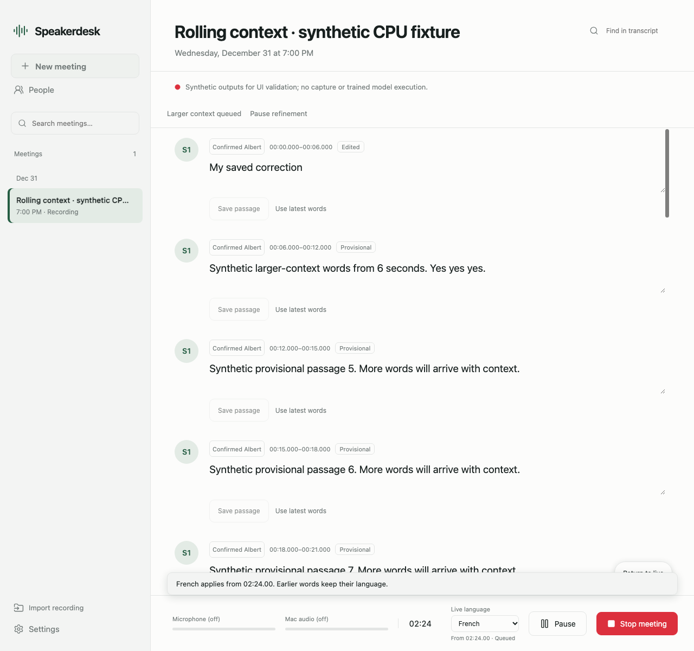
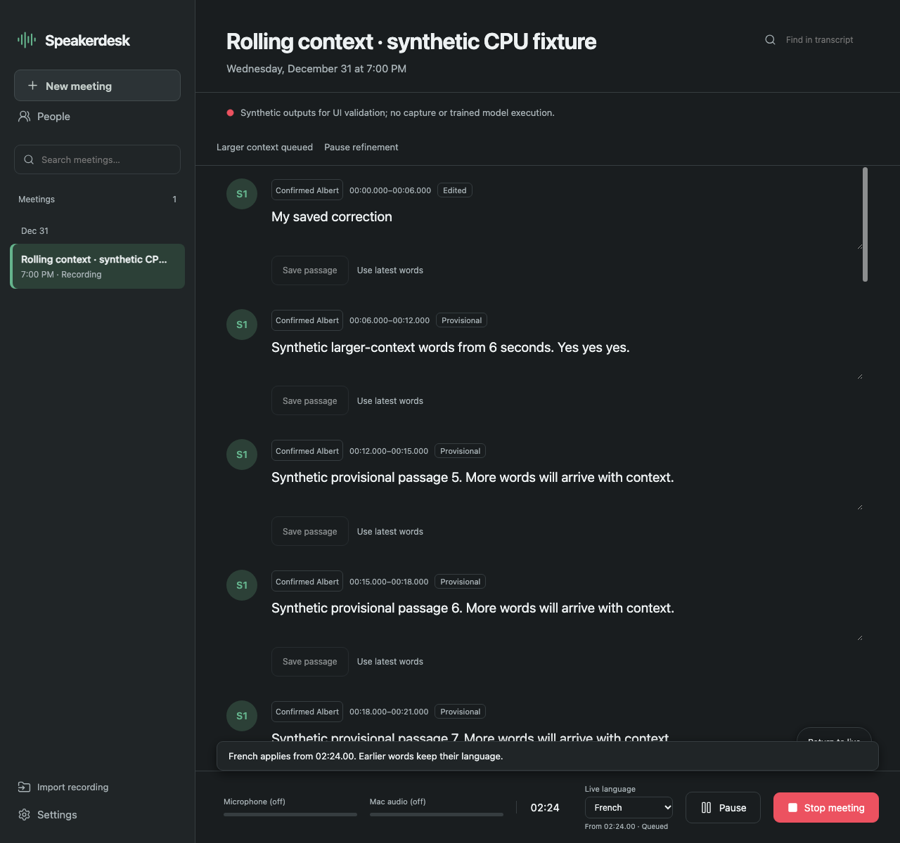

# Rolling live refinement

Status: worker, SQLite persistence, targeted passage edits, language controls,
enrollment UI and browser reconciliation are implemented together in the isolated
`codex/rolling-live-refinement` branch based on released source
`846286eed2f358d3dfc6afced8ecf8b0cef2a96a`. CPU and installed-browser checks pass.
This is not a released feature or evidence of improved trained-model accuracy.

## Diagnosis from 0.3.0 source

`live_worker.py` calls streaming NVIDIA with threshold .5, minimum duration zero
and merge gap zero. Feed activity is merged only within .20 seconds per speaker;
every simultaneous active speaker then creates a separate mixed region. Short
secondary activations can therefore fragment otherwise useful speech. Actual
user audio has not been inspected, so the amount of acoustic false overlap is
unknown; raising a threshold without measurement would not establish a fix.

AUTO `SpeechTranscriber` explicitly abstains for every mixed-speaker crop. Its
three-second language probes can produce multiple blank rows per crop. The live
worker also marks a six-second phrase for review solely for reaching its length
cap. `app.js` repeats a Review badge, language warning and explanatory paragraph
on those rows while they are still arriving. Earlier chunks are never revisited.
These rules explain excessive review presentation even when the model has not
made a final decision. The original audio is already written and flushed before
each inference packet, so a second pass can read retained local audio safely.

## Intended two passes

The resident worker keeps provisional phrase output for low latency. Provisional
rows get one compact state label; warning paragraphs and manual review badges
wait until refinement leaves a passage unresolved. A six-second transport/phrase
limit alone will no longer be a review reason. Mixed audio remains mixed audio.

NVIDIA uses its official `low` preset for streaming and temporarily selects
`offline` for each bounded refinement call. That call creates a separate model
state; `finally` restores `low` before streaming continues.

A separate reader drains commands while the same model executor serializes
streaming and refinement work. Capture and the UI continue asynchronously;
multiple MLX/Metal passes do not run concurrently. Streaming backlog has priority.
Refinement runs only with at most two seconds of live inference backlog.

The planner requests an owned core of at most 18 seconds with up to three seconds
of retained context on each side: at most 24 seconds total. It runs after three
completed sections and an eight-second scheduling delay, or when a full core and
right context are available. Existing machine-owned utterance ends determine
ownership boundaries. Pause and stop flush a partial tail. No request contains
the whole meeting, and no automatic pass repeatedly reruns an old window.

Larger context can improve NVIDIA activity decisions and ASR grouping. Independent
batch diarization speaker slots must be conservatively mapped to original live
tracks using temporal evidence; ambiguous mapping keeps mixed/unknown ownership.
Confirmed names are never inferred again. Mixed audio may be transcribed with a
confident local language decision but cannot become a clean voice-enrollment clip
or a claim that the voices were separated. This behavior needs trained-model
evaluation before release; no language threshold is tuned on the held-out set.

Cohere input crops remain at most 24.5 seconds. Context audio is used for diarization
and deciding crop boundaries; ASR text may enter only the disjoint owned interval.
Without word timestamps it is unsafe to transcribe both overlapping contexts and
clip their text by time. This design avoids that duplicate-text mechanism but
cannot guarantee model word completeness or exact word-boundary cuts. Original
audio and previous window revisions remain available for correction.

## Reconciliation and lifecycle contracts

`rolling_refinement.py` implements a bounded two-request plan, durable completed
audio cursor, unique operation IDs, bounded retries and cancel/resume behavior.
After an explicit recovery, in-flight work is requeued from the same retained
audio with a new operation ID. Late results from cancelled or previous attempts
cannot acknowledge a newer operation. Backlog resides in a cursor into the WAV,
rather than an unbounded in-memory PCM or request queue.

The reconciler copies its input, rejects context text outside ownership and
overlapping duplicate candidates, preserves IDs by audio overlap, and returns
the previous window revision. A source snapshot hash covers words, timing,
speaker, machine revision and protected fields. Changed or protected rows and
intersecting candidates remain untouched. Blank/partial replacement cannot erase
previous legible words; protection propagates across shared candidates so a
neighbor cannot lose part of its source audio. Confirmed/custom names use
`setdefault`, never replacement by guessed names.

Integration persists the plan, result and previous revision atomically under
the existing job lock/SQLite transaction. Each provisional row gets a deterministic
audio anchor plus a machine revision. A targeted passage-edit endpoint records
server-owned protected fields and uses the row revision, allowing edits without
racing the constantly advancing job revision. Confirmed identity assignments
remain protected. Unchanged rows are patched in the DOM; focused/dirty rows and
the viewport's first visible audio anchor retain focus and scroll position.

Pause flushes settled audio without restarting capture or changing permissions.
Stop closes capture, drains the provisional tail and performs bounded final
refinement; any unfinished window remains persisted/resumable rather than
holding Stop indefinitely. Cancel only cancels refinement. A process crash keeps
the last persisted transcript, prior revision and audio; recovery never resumes
device capture automatically. Failed refinement leaves usable provisional words
and one compact unresolved state instead of repeated warning rows.

## Fast-path boundary continuity

The first unfinished decode appears after six seconds, then revisits the same
saved-audio origin at three-second intervals. It replaces the provisional tail
rather than appending another six-second fragment. Speech boundaries are preferred;
a continuous phrase owns at most 18 seconds, with up to three seconds of right
context. The next core carries three seconds of left audio. A reference decode
and extended decode share that left-audio origin; only a verified lexical prefix
is removed. Real repeated tokens remain repeated. This is lexical continuity,
not word timestamps. All native ASR reads stay at most 24.5 seconds.

If a context hypothesis cannot be reconciled conservatively, the full candidate,
previous usable words and original WAV remain available. The uncertain tail waits
for refinement rather than introducing a guessed suffix. This fallback can still
leave incomplete text and requires trained-model evaluation for natural speech,
accents, within-probe language switches and overlapping voices.

Brief activity changes are grouped for ASR while retaining the union of all
speaker candidates. Grouping uses a 1.5-second presentation/ASR threshold and a
.20-second gap; it does not declare short activations false. Mixed regions stay
mixed and cannot become clean enrollment audio. Confident local language routing
may admit Cohere text from the mix; it does not separate the voices.

## Persistence and controls

`live_refinement.py` keeps model execution serial and coalesces PCM notifications
into source-WAV ranges. `meeting_refinement.py` stores operation IDs, source
snapshots, protected fields, candidates and prior revisions atomically in the
job payload. Each failed operation gets at most two attempts; skipped older-language audio,
shorter candidates, empty ASR and token-limited output retain unresolved ranges
for an explicit retry. Recovery clears covered sample ranges even when utterance
boundaries change their window IDs. Incomplete candidates cannot replace earlier
usable words or make the job report complete. Stop has a 45-second refinement budget
inside the existing 60-second completion bound. Unfinished work remains paused
and resumable. Explicit recovery starts only the inference worker over saved WAV
and never starts capture. Historical recovery routes each owned window through
its original language generation. Ordinary live language changes preserve earlier
words and invalidate stale queued replacements.

A live passage uses `PATCH /api/jobs/<id>/segments/<segment-id>` with
`segment_revision` and `changes`. The server protects edited fields. Whole-project
saves cannot clear those fields or manufacture clean audio/source metadata.
`POST /api/jobs/<id>/refinement/pause|resume` controls background refinement;
`GET /api/jobs/<id>/refinement/revisions/<window-id>` reads retained prior words.
`fast-revisions/<start-sample>` and `boundary-candidates` under the same refinement
API expose retained fast revisions and ambiguous full-context candidates. Repeated
window retries append history versions rather than erasing older snapshots.
Focused local drafts survive polling and changed passage bounds. A stale Save is
rejected with the draft retained and latest words shown. Unchanged DOM nodes stay
in place; explicit audio-anchor scroll compensation handles merged rows.

## Validation and release boundary

The full integrated CPU suite passes: **181 tests**. It exercises
production scheduling, the resident engine and real JSONL/pipes/SQLite/WAV with
explicit synthetic model substitutes. New cases include a through-word six-second
cut, sentence punctuation, genuine repetition, lexical code switching, 80 seconds
of continuous speech, short final context, pause/resume/stop, micro overlap,
conservative slot mapping, saved-prefix edits, stale operations, failed retries,
placeholder recovery and restart without capture. Existing import, language,
voice eligibility, enrollment and error-cleanup regressions also pass.

Ten installed headless Chrome checks pass with zero page errors on the production
HTML/JS/API and an explicitly synthetic fixture. They cover compact pending rows,
focused drafts, stale-save rejection, protected saved edits, confirmed names,
scroll preservation, refinement controls, the live language/default boundary and
delete protection while a saved refinement owns the meeting.
The enrollment lane's browser flow also passes after integration, including
bounded preview, consent reset and actionable empty-clip reasons.

Reproduce using an existing Python environment and installed Chrome:

```sh
<python> -m unittest discover -s tests -v
<python> tests/rolling_browser_fixture.py <evidence-directory>
node tests/rolling_browser.mjs <printed-url> <installed-chrome> <evidence-directory>
<python> tests/people_browser_fixture.py <people-evidence-directory>
node tests/people_browser.mjs <printed-url> <installed-chrome> <people-evidence-directory>
```

Screenshots contain synthetic CPU outputs:





A real local MLX NVIDIA/Cohere synthetic replay ran at commit `00d6615`: 49.758
seconds of installed-voice audio preserved through capture quantization, 15 provisional revisions,
three successful contextual results, Auto English to French at sample 664136,
and a protected edit retained through pause/resume and Stop. One French phrase
grew from 6.48 to 7.10 seconds at the same audio origin and added “les noms.”
The bounded process exited 0 after 55.66 seconds, with 1.95 GB peak process-tree RSS
and 2.145 GB reported peak MLX allocation. The corresponding hosted ad-hoc Mac
package build succeeded; it was not downloaded or launched.

That replay exposed falsely complete refinement bookkeeping, corrected by this
follow-up. Corrected source `861fcd7` subsequently passed a real-model replay
and explicit saved-audio recovery in 58.35 seconds, preserving protected edits,
original per-range languages and the WAV across retry. All 796,128 frames match
the documented float32-to-PCM16 capture conversion; fixture PCM16 differs by at
most one unit. The fresh worker produced 15 provisional revisions and five
successful contextual results with 2.00 GB peak process-tree RSS. A previously
blank English sentence was recovered. Independent evidence review confirmed
these results after qualifying the PCM conversion.

Two retry ranges correctly remain unresolved: English and French candidate
endpoints are 10–21.5 ms shorter than retained provisional coverage. Original
usable words remain; deterministic retries keep the review state. This verifies
the controller contracts, rather than establishing natural-meeting accuracy. Speaker mapping still left several
clean synthetic regions mixed/unknown; brief uncertain Auto regions remained
blank review placeholders. Real microphone/system capture and natural-meeting
acoustic accuracy are unverified. Keep 0.3.0 release assets and website publication
separate from this source branch.
